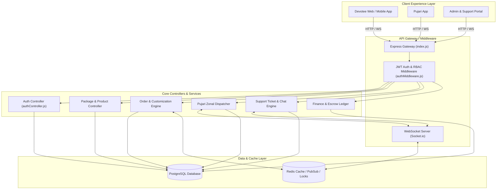
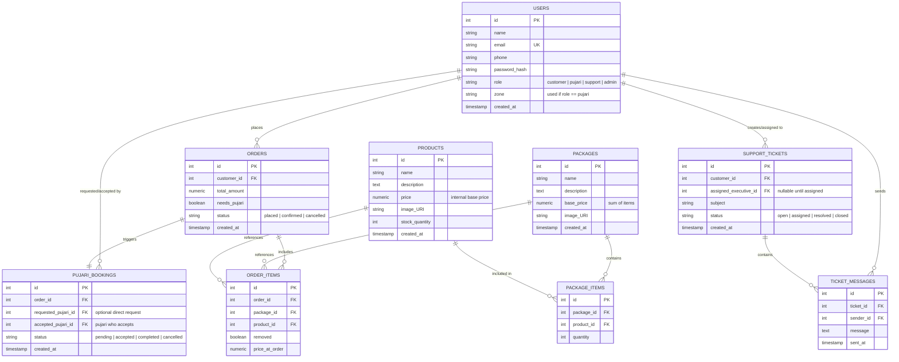

# System Architecture Document

## Recommended Tech Stack

| Layer | Primary Technology | Rationale & Note |
| :--- | :--- | :--- |
| **Database** | **PostgreSQL (SQL)** | Authoritative relational database for strict transactional consistency (ACID), foreign keys, order/payment ledgers, and spatial zone matching. |
| **Backend Runtime** | **Node.js + Express.js (ES Modules)** | Asynchronous, non-blocking I/O ideal for real-time WebSocket event handling, API endpoints, and micro-services readiness. |
| **Authentication & RBAC** | **JWT + bcrypt** | Token-based auth with payload containing user role (`customer`, `pujari`, `support`, `admin`) and Pujari `zone`. |
| **Real-Time Communication** | **Socket.io / WebSockets + Redis Pub/Sub** | Enables instant zonal Pujari notifications (broadcast) and bidirectional live chat between Customers and Support Executives. |
| **Cache & Task Queue** | **Redis + BullMQ** | Fast session caching, distributed locks (prevent double Pujari bookings), and background job processing. |
| **Admin Dashboard UI** | **React.js / Next.js + Vanilla CSS / Tailwind** | Responsive, high-performance admin portal with rich real-time UI components, chat streams, and dashboard analytics graphs. |

---

## High-Level System Architecture



---

## Relational Database Schema (PostgreSQL)



---

## Codebase Directory Structure (`pooja_backend`)

```
pooja_backend/
├── config/
│   └── db.js                 # PostgreSQL connection pool (pg)
├── controllers/
│   ├── authController.js     # User registration, login, profile (getMe)
│   ├── packageController.js  # Package listing & relational item query
│   └── productController.js  # Product inventory CRUD
├── middleware/
│   └── authMiddleware.js     # JWT authentication & RBAC authorization
├── routes/
│   ├── authRoutes.js         # /api/auth routes
│   ├── packageRoutes.js      # /api/packages routes
│   └── productRoutes.js      # /api/products routes
├── schema/
│   └── schema.sql            # Authoritative SQL database schema
├── .env                      # DB credentials & JWT secret
├── index.js                  # Express server entry point & route mounting
└── package.json              # Backend dependencies
```
