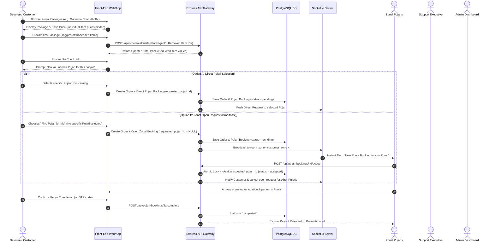
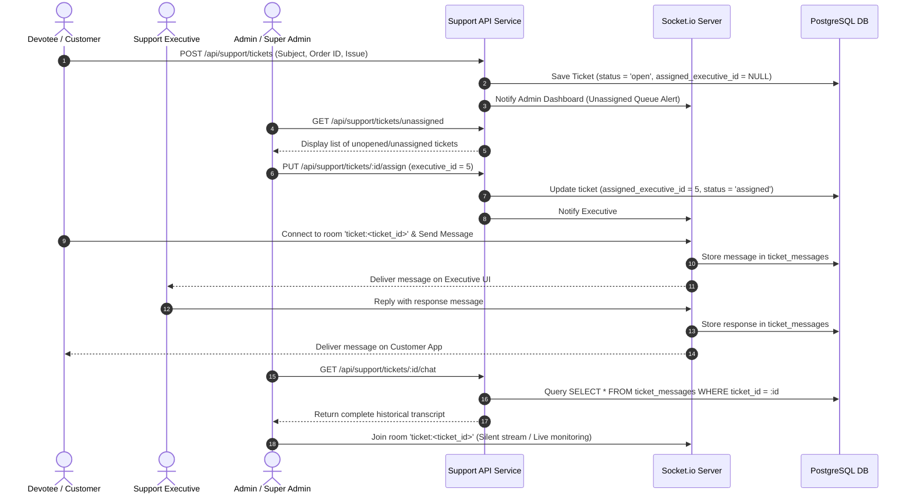
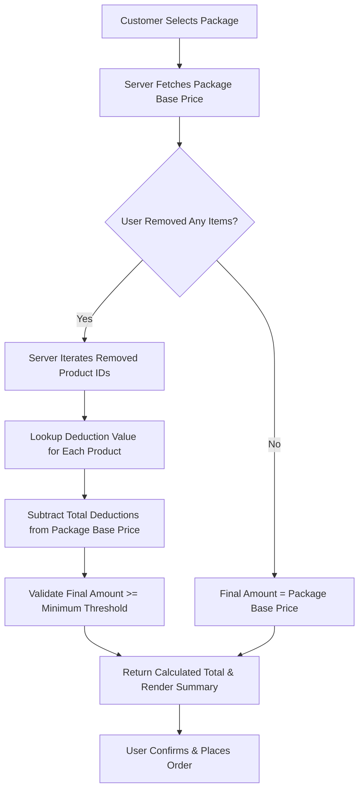

# System Workflows & User Flow Diagrams (flow.md)

## 1. Master E-Commerce & Pujari Booking Flow

---

## 2. Customer Support Ticket & Admin Chat Inspection Flow

---

## 3. Package Price Customization & Calculation Flow

